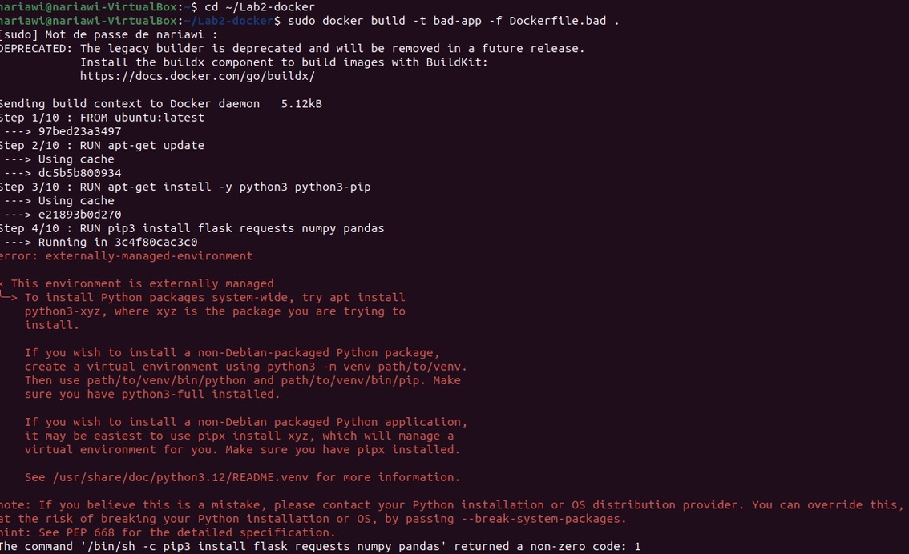
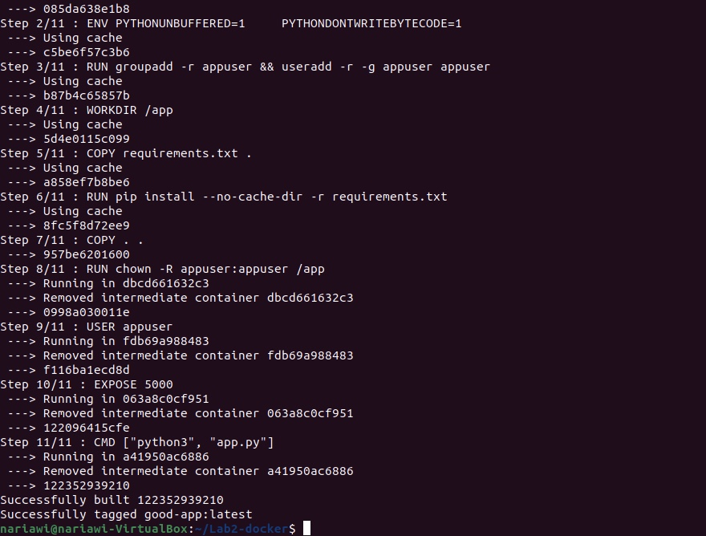
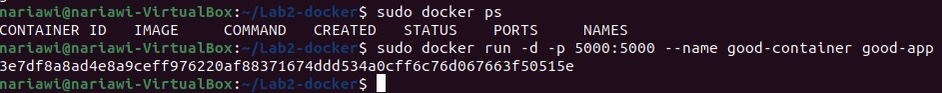
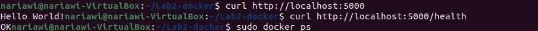

# Лабораторная работа №2 — Docker 

## 1. Введение

В данной работе мы создавали два Dockerfile — плохой и хороший, сравнивали их работу, анализировали ошибки и проверяли запуск контейнера с простым Flask-приложением.

Наше приложение -app.py имеет два маршрута:
- `/` — Выводит Hello World!
- `/health` — возвращает OK

## 2. Плохой Dockerfile (Dockerfile.bad)

Мы намеренно допустили типичные ошибки, чтобы показать плохие практики.

### Ошибки в плохом Dockerfile

- **FROM ubuntu:latest**  
  Использование latest делает сборку непредсказуемой — версия Ubuntu может измениться.

- **Установка пакетов без оптимизации**  
  Множественные инструкции RUN увеличивают количество слоев и размер образа.

- **Прямая установка Python-пакетов через pip**  
  Отсутствует контроль версий зависимостей, возникает ошибка PEP 668.

- **COPY . /app**  
  Копируются все файлы, включая временные и служебные.

- **Запуск процесса от root**  
  Это небезопасно, но часто встречается у начинающих.

### Результат

Образ не собирается из-за ошибки PEP 668, что демонстрирует серьезность плохой практики.

## 3. Хороший Dockerfile (Dockerfile.good)

Исправления, которые мы внесли:

- **python:3.9-slim** — конкретная версия Python, лёгкий и стабильный образ
- **requirements.txt** — надёжное управление зависимостями
- **Раздельный COPY + оптимизированные RUN-инструкции** — улучшенное кеширование и меньший размер образа
- **Создан пользователь appuser** — контейнер не работает от root
- **EXPOSE 5000** — явное указание порта приложения

### Результат

Сборка проходит успешно, образ лёгкий, аккуратный и запускается без ошибок.

## 4. Сборка и запуск

### Сборка плохого образа

    sudo docker build -t bad-app -f Dockerfile.bad .

### Сборка хорошего образа

    sudo docker build -t good-app -f Dockerfile.good .

### Запуск контейнера

    sudo docker run -d -p 5000:5000 --name good-container good-app
## Результат

## 5. Проверка работоспособности

После исправления всех ошибок нам удалось:

### Успешно собрать образ:

    docker build -t good-app -f Dockerfile.good .

### Запустить контейнер:

    docker run -d -p 5000:5000 good-app

### Проверить работу приложения:

    curl http://localhost:5000
    #  Hello World!

    curl http://localhost:5000/health  
     #  OK
### Результат

## 6. Две плохие практики при работе с контейнерами

### 1. Запуск контейнера с флагом --privileged

Контейнер получает слишком много прав, что может привести к уязвимостям.

### 2. Проброс Docker socket внутрь контейнера

    -v /var/run/docker.sock:/var/run/docker.sock
Контейнер получает полный доступ к Docker-хосту - критически небезопасно.

## 7. Проблемы, с которыми столкнулись

Проблема прав доступа — приходилось использовать sudo для Docker команд

Ошибка в создании файлов — команда cat записывалась в файлы вместо содержимого

PEP 668 ошибка — подтвердила, что наша плохая практика действительно не работает

## 8. Выводы

Работа показала, что даже небольшие ошибки в Dockerfile могут привести к серьёзным последствиям: неработоспособность образа, проблемы с безопасностью и увеличенный размер.

Использование конкретных версий образов, правильное управление зависимостями и оптимизация инструкций Dockerfile позволяют получать более надёжные и лёгкие контейнеры.

Полученный опыт поможет нам избегать подобных ошибок в реальных проектах.