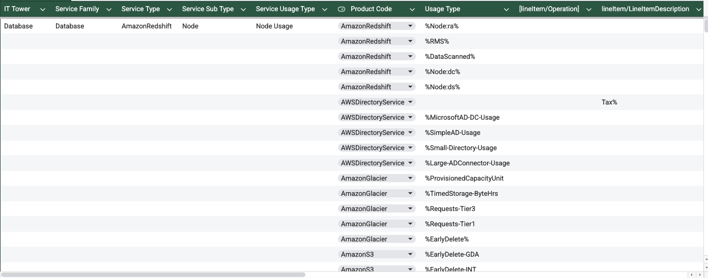
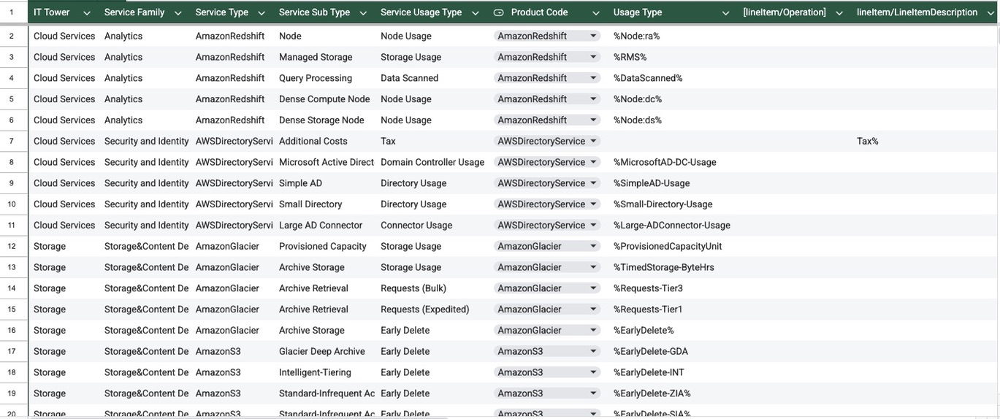

# Лабораторная работа №1 (Классификация облачных сервисов AWS и построение сервисной модели)

### Мы выбирали Вариант 1 

#### 1. Цель работы
Знакомство с облачными сервисами Amazon Web Services (AWS), понимание уровней абстракции над инфраструктурой в облаке и формирование сервисной модели потребления ресурсов на основе данных биллинга.
#### 2. Исходные данные
Файл с данными биллинга AWS: Mapping Rules AWS team 1.csv

Образец классификации: Mapping Rules AWS Example.csv

Данные представлены в формате CSV с разделителем "точка с запятой".
#### 3. Описание выполненной работы
##### 3.1. Подготовка данных
Файл Mapping Rules AWS team 1.csv был импортирован в Google Sheets через функцию "Импорт данных".

Установлен разделитель столбцов: точка с запятой.

Проведена проверка структуры данных — определены столбцы:

IT Tower (пусто)

Service Family (пусто)

Service Type (пусто)

Service Sub Type (пусто)

Service Usage Type (пусто)

Product Code (заполнен)

Usage Type (заполнен)

##### 3.2. Исследование и анализ
Для точной классификации были проведены дополнительные исследования:

Использованные источники информации:

Официальная документация AWS:

AWS Pricing Documentation для понимания структуры тарификации

AWS Service Definitions для классификации сервисов

Специфические страницы сервисов (Redshift, S3, Glacier)

Практические ресурсы:

AWS Management Console для проверки актуальных наименований сервисов

Форумы AWS для уточнения неоднозначных типов использования

Сравнительный анализ:

Сопоставление с предоставленным образцом классификации

Анализ аналогичных сервисов в других облачных провайдерах

##### 3.3. Методология классификации
Для каждой строки исходного файла выполнялись следующие шаги:

Шаг 1: Определение Product Code → преобразование в понятный Service Type.
Пример: AmazonRedshift → Amazon Redshift.
Источник: Официальное наименование в AWS Console.

Шаг 2: Выбор IT Tower на основе типа сервиса.
Пример:

Amazon S3 → Storage (согласно категоризации AWS)

AWS Directory Service → Cloud Services

Amazon Redshift → Cloud Services (исследование показало, что Redshift относится к аналитическим сервисам, а не чистым базам данных)

Шаг 3: Выбор Service Family согласно таблице соответствий.
Пример:

Storage → Storage&Content Delivery

Cloud Services → Analytics, Application Services, Security and Identity и т.д.

Шаг 4: Анализ Usage Type для определения подтипа и типа использования.
Пример:

%Node:ra% → Node (подтип), Node Usage (тип использования)

%EarlyDelete-GDA → Glacier Deep Archive (подтип), Early Delete (тип использования)
Примечание: Для понимания сокращений (GDA, SIA, ZIA) потребовалось обращение к документации S3 Storage Classes.

Шаг 5: Заполнение всех пяти столбцов классификации.
##### 3.4. Сложности и принятые решения
Сложность 1: Отнесение Amazon Redshift
Первоначально была неопределённость: является ли Redshift "базой данных" или "аналитическим сервисом".

Исследование:

Анализ AWS Service Catalog показал, что Redshift находится в категории "Analytics"

Сравнение с Azure Synapse Analytics (аналог) подтвердило аналитическую природу сервиса

В документации AWS Redshift позиционируется как "cloud data warehouse"

Решение: Классифицировать Redshift как Cloud Services → Analytics, поскольку:

В образце для баз данных используется только RDS

Redshift позиционируется как data warehouse/аналитическое решение

В перечне IT Tower отсутствует отдельная категория "Analytics", только внутри Cloud Services

Сложность 2: Классификация налоговых сборов
Исследование: Анализ образца показал, что все налоговые строки имеют особую обработку.

Решение: Следование образцу — все строки с Tax% отнесены к Application Services → Additional Costs → Tax.

Сложность 3: Разные типы использования одного сервиса
Пример: Amazon S3 имеет 6 типов запросов (Tier1-Tier6), разные классы хранения.

Исследование:

Изучение S3 Pricing Page для понимания различий между tier'ами запросов

Анализ S3 Storage Classes документации для расшифровки сокращений (GDA, SIA, ZIA)

Решение: Единый Service Type (Amazon S3) с разными Service Sub Type и Service Usage Type.

Сложность 4: Расшифровка сокращений в Usage Type
Примеры исследований:

%Node:dc% → исследование Redshift Node Types показало, что "dc" означает "Dense Compute"

%Node:ds% → "ds" означает "Dense Storage"

%EarlyDelete-GDA → GDA = "Glacier Deep Archive" (найдено в S3 Storage Classes)

%SMS-Price% и %SMS-Sent% → изучение Amazon SNS SMS Pricing для понимания различий

#### 4. Результаты работы
##### 4.1. Статистика классификации
Всего классифицировано: 42 сервиса/строки

Использовано IT Tower: 3 категории (Cloud Services, Storage, Database)

Использовано Service Family: 7 категорий

Наиболее частый Service Family: Application Services (9 строк)

Количество обращений к внешним источникам: ~15 различных документаций/ресурсов

##### 4.2. Структура сервисной модели
Создана иерархическая модель, позволяющая анализировать потребление:

Уровень 1: IT Tower (высокоуровневая категория)

Уровень 2: Service Family (функциональная группа)

Уровень 3: Service Type (конкретный сервис AWS)

Уровень 4: Service Sub Type (вариант/конфигурация сервиса)

Уровень 5: Service Usage Type (тип потребления/начисления)

##### 4.3. Верификация результатов
Для проверки корректности:

Сравнение с образцом — совпадение логики классификации

Проверка консистентности — одинаковые сервисы имеют одинаковые IT Tower/Service Family

Логическая проверка — тип использования соответствует подтипу сервиса

Кросс-проверка по документации — соответствие официальным определениям AWS

#### 5. Выводы
Достигнута цель работы — создана детальная сервисная модель потребления облачных ресурсов AWS.

Определены ключевые принципы классификации, которые будут использованы в Лабораторной работе №2 для Azure.

Установлено, что некоторые сервисы могут относиться к разным категориям в зависимости от типа использования (например, налоги vs основное использование).

Подтверждена важность анализа документации провайдера для точной классификации.

Необходимость исследований — многие сокращения и типы использования требуют обращения к актуальной документации для правильной интерпретации.

Важное наблюдение: Без дополнительных исследований и обращения к актуальной документации AWS было бы невозможно правильно классифицировать многие сервисы, особенно те, что используют внутренние сокращения и специфическую терминологию.
#### 6. Наша выполненная работа

##### 6.1. Список использованных источников
AWS Official Documentation: https://docs.aws.amazon.com

AWS Pricing Calculator: https://calculator.aws

AWS Service List: https://aws.amazon.com/products/

S3 Storage Classes Documentation

Redshift Node Types Documentation

AWS Directory Service Pricing

Amazon SNS SMS Pricing Details

##### 6.2. Итоговый файл
Ссылка на выполненной работе можете найти ниже:

https://docs.google.com/spreadsheets/d/1ynbQQ-w_374_JYqEiF9d8_qoNVSS_zohAjoMguXnsy8/edit?usp=sharing

#### 7. Личные наблюдения и опыт
В ходе работы я столкнулся с несколькими важными аспектами:

Важность актуальной информации: Некоторые сервисы AWS меняют свои наименования и типы использования. Без обращения к текущей документации можно допустить ошибки в классификации.

Необходимость глубокого понимания: Простое сопоставление по названию недостаточно. Например, различие между "SMS-Price" и "SMS-Sent" в Amazon SNS требовало изучения модели ценообразования.

Контекст использования: Один и тот же сервис может классифицироваться по-разному в зависимости от контекста (например, налоговая строка vs основное использование).

Навыки исследования: Работа развила навыки поиска информации в технической документации и её анализа для решения практических задач.

Работа выполнена самостоятельно с использованием документации AWS, предоставленного образца классификации и дополнительных исследований для уточнения неоднозначных моментов. Все решения принимались на основе анализа предоставленных материалов, логических выводов и проверки по актуальным источникам информации.