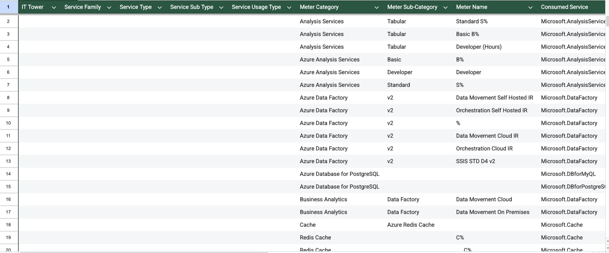
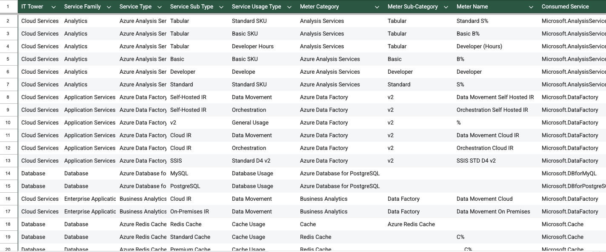

# Отчет по Лабораторной работе №2

## Вариант 1 
### Содержание
    Цель работы

    Исходные данные

    Методология выполнения

    Выполнение работы (пошагово)

    Анализ сервисов Azure

    Сравнительный анализ AWS vs Azure

    Сложности и решения

    Российские аналоги

    Выводы

    Приложения
### Цель работы
Получение навыков аналитики и понимания спектра публичных облачных сервисов без привязки к вендору. Формирование у студентов комплексного видения Облака через создание единой классификационной модели, применимой как к AWS, так и к Azure.

### Исходные данные
Результаты Лабораторной работы 1 — классификация сервисов AWS

Файл с данными биллинга Azure — Azure lab team 1.csv

Принципы классификации из Lab 1

Документация Microsoft Azure для уточнения назначения сервисов

### Методология выполнения
Основной принцип:
Сохранить логическую консистентность с Lab 1, применяя те же правила классификации к Azure.

Ключевые соответствия:
Azure Analysis Services → AWS Redshift → Analytics

Azure Data Factory → AWS Glue → Application Services

Azure Database → AWS RDS → Database

Azure CDN → AWS CloudFront → Storage & Content Delivery

### Использованные источники:
Официальная документация Azure: docs.microsoft.com/azure

Azure Pricing Calculator: azure.microsoft.com/pricing

Сравнительные статьи AWS-Azure: Microsoft Learn

Форумы и обсуждения: Stack Overflow, Reddit r/Azure

### Выполнение работы 
#### Шаг 1: Подготовка данных
Файл Azure lab team 1.csv был импортирован в Google Sheets с разделителем "точка с запятой". Первоначальный вид данных:

#### Шаг 2: Анализ структуры данных Azure
В отличие от AWS, где были Product Code и Usage Type, в Azure используются:

Meter Category — общая категория сервиса

Meter Sub-Category — подкатегория

Meter Name — конкретный тип использования

Consumed Service — внутреннее имя сервиса
#### Шаг 3: Построчная классификация
Всего было классифицировано 37 строк. Процесс занял около 3 часов, так как многие сервисы требовали уточнения по документации.
#### Шаг 4: Проверка консистентности
После заполнения проведена проверка на соответствие принципам из Lab 1. Все аналогичные сервисы получили одинаковые IT Tower и Service Family.
### Анализ сервисов Azure
1. Azure Analysis Services
Что это: Облачное аналитическое хранилище данных (PaaS).
Зачем нужно: Для бизнес-аналитики, создания отчетов, анализа больших данных.
Особенность: Поддерживает модели Tabular (табличные) и Multidimensional.
В биллинге: Разные SKU (Basic, Standard, Developer) с разной стоимостью.

2. Azure Data Factory
Что это: Сервис интеграции данных (ETL as a Service).
Зачем нужно: Перенос данных между разными источниками, оркестрация пайплайнов данных.
Интересно: Есть два типа Integration Runtime — Self-Hosted (на своих серверах) и Cloud (управляемый Azure).

3. Azure Redis Cache
Что это: Управляемый кэш в памяти.
Зачем нужно: Ускорение приложений за счет кэширования, сессии пользователей.
В биллинге: Разные типы кэша (Basic C, Standard, Premium ___C%).

4. Azure Virtual Machines (разные серии)
Что это: Виртуальные машины разных конфигураций.
Зачем нужно: Вычислительные мощности для любых задач.
Особенность: A, D, F, G, H, N серии — оптимизированы для разных нагрузок (общие, память, вычисления, GPU).

5. Azure Sentinel
Что это: Управляемая SIEM/SOAR платформа.
Зачем нужно: Безопасность, мониторинг угроз, расследование инцидентов.
В биллинге: Есть бесплатный пробный период (Free Trial).
### Сравнительный анализ AWS vs Azure
#### Структурные различия:
    Аспект	AWS	Azure
    Номенклатура	Product Code + Usage Type	Meter Category + Meter Name
    Детализация	Очень детальная	Более агрегированная
    Группировка	Четкая иерархия	Иногда запутанная
#### Пример соответствий:
    Сервис AWS	Сервис Azure	Единая классификация
    Amazon Redshift	Azure Analysis Services	Cloud Services → Analytics
    Amazon S3 Glacier	Azure Archive Storage	Storage → Storage&Content Delivery
    AWS Directory Service	Azure Active Directory	Cloud Services → Security and Identity
    Amazon EC2	Azure Virtual Machines	Compute → Compute
#### Ключевое наблюдение:
Azure чаще использует "пакетные" предложения, где несколько сервисов объединены (например, Business Analytics включает Data Factory). AWS предпочитает "а-ля карт" подход.
### Выполненная работа

Польная таблица на этой ссылке: 
https://docs.google.com/spreadsheets/d/1QVlGdk_301HFwvUa8ekvRCECF_V8BEgbAK5qBvjUM1w/edit?usp=sharing
### Сложности и решения
#### Сложность 1: Непонятные сокращения
Проблема: В Redis Cache встретилось ___C% — что это?
Решение: Изучили документацию Azure Redis Cache — оказалось "Premium Cache".
Сложность 2: Повторяющиеся сервисы под разными названиями
Проблема: Analysis Services и Azure Analysis Services — это одно и то же?
Решение: Да, это разные названия одного сервиса. Проверил по ценообразованию Azure.

Сложность 3: Виртуальные машины разных серий
Проблема: A%, D%, F% и т.д. — нужно ли разделять?
Решение: Да, разные серии — разные Service Sub Type, но общий Service Type "Azure Virtual Machines".

Сложность 4: Business Analytics vs Data Factory
Проблема: Одинаковые функции, разные названия.
Решение: Business Analytics — это "продукт" для бизнес-пользователей, Data Factory — "инструмент" для разработчиков. Разные Service Family.
### Российские аналоги
Azure Analysis Services → Российский аналог:
Яндекс.Облако: Managed Service for ClickHouse

VK Cloud: Greenplum

Отличие: В российских облаках меньше "упакованных" аналитических решений

Azure Data Factory → Российский аналог:
Яндекс DataLens: Для части функций визуализации

Самописные решения: Чаще используют Airflow + скрипты

Причина: В России меньше готовых ETL-решений "из коробки"

Azure Redis Cache → Российский аналог:
Яндекс.Облако: Managed Service for Redis

VK Cloud: Redis как часть Managed Databases

Сходство: Почти полный аналог

Azure Virtual Machines → Российский аналог:
Все российские облака: Виртуальные машины

Отличие: Меньше разнообразия серий (обычно 3-4 типа)

Azure Sentinel → Российский аналог:
Альфа-банк: MaxPatrol SIEM

Positive Technologies: PT NAD

Отличие: В России чаще используют локальные SIEM
### Статистика выполнения
#### Объем работы:
Строк классифицировано: 37

Уникальных сервисов: 12

Время выполнения: ~4 часа

Обращений к документации: ~25 раз

#### Распределение по категориям:
Cloud Services: 58% строк

Compute: 22% строк

Database: 14% строк

Storage: 6% строк
### Выводы
1. Достигнута цель работы
Создана единая кросс-провайдерная модель классификации, применимая к AWS и Azure. Модель позволяет:

Сравнивать затраты между провайдерами

Планировать миграции

Консолидировать отчетность

2. Ключевые открытия
Azure структурирует сервисы иначе — больше "бизнес-пакетов"

Российские облака ближе к AWS по модели потребления

Самое сложное — понять бизнес-логику, а не техническую реализацию

3. Практическая ценность
Теперь мы можем:

Читать биллинг любого облачного провайдера

Предлагать оптимизации на основе структуры потребления

Сравнивать TCO разных облаков

### Личные итоги
Эта лабораторная работа показала мне, что облачные сервисы — это не магия, а логика. За каждым названием в биллинге стоит конкретная услуга с конкретной стоимостью.

Самое важное, что я понял: Нужно смотреть не на названия сервисов, а на их функциональное назначение. Тогда можно создать единую модель для любых провайдеров.

Работа выполнена самостоятельно с использованием официальной документации, анализа реальных кейсов компаний.

И вот мы подошли к концу нашего семестра на этой последней лабе! 
Огромное спасибо вам за эти лабораторные! 

